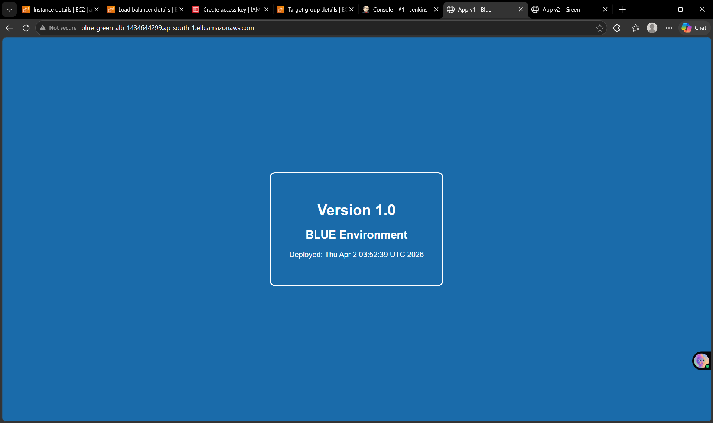
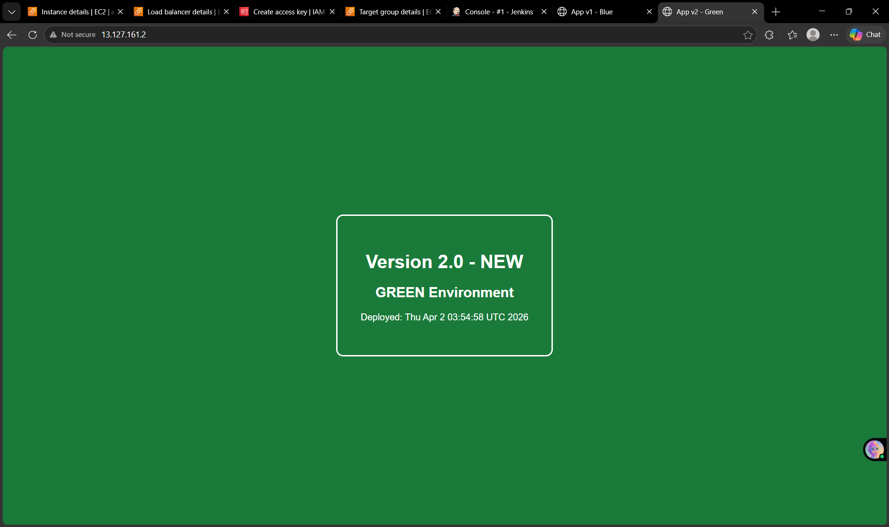
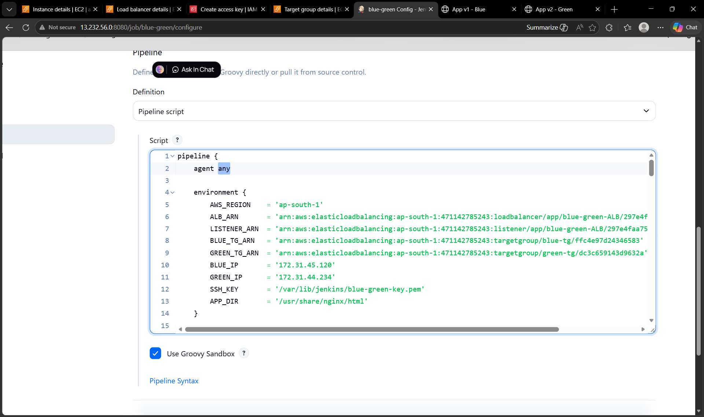

# 🚀 Production-Ready Blue-Green Deployment using Jenkins & AWS ALB

## 📌 Project Overview
This project implements a **Blue-Green Deployment strategy** to achieve **zero-downtime application releases**.  
It eliminates downtime by maintaining two identical environments and switching traffic only after successful validation.

The deployment process is fully automated using **Jenkins CI/CD pipeline** and **AWS Application Load Balancer (ALB)**.

---

## 🎯 Objective
- Ensure zero downtime during deployments  
- Maintain two environments (**Blue & Green**)  
- Deploy new versions to inactive environment  
- Perform health checks before traffic switching  
- Automatically rollback on failure  

---

## 🏗️ Architecture Diagram

### 🔹 Architecture Flow
1. User sends request to ALB  
2. ALB routes traffic to active environment (Blue/Green)  
3. Jenkins deploys new version to inactive environment  
4. Health check validates deployment  
5. Traffic switches to new environment  
6. Rollback occurs automatically if failure detected  

---

## 🌐 Environments

### 🔵 Blue Environment

- Acts as one production environment  
- Initially serves live traffic  
- Runs **Version 1** of application  

---

### 🟢 Green Environment

- Secondary environment  
- Used for deploying new versions  
- Runs **Version 2** of application  

---

## ⚙️ Infrastructure Setup

### 🔹 EC2 Instances
- Blue Server (Application Server)  
- Green Server (Application Server)  
- Jenkins Server (CI/CD Server)  

### 🔹 Target Groups
- `blue-tg` → Connected to Blue EC2  
- `green-tg` → Connected to Green EC2  

### 🔹 Load Balancer
- Application Load Balancer (ALB)  
- Listener configured to forward traffic  
- Initially routes traffic to **Blue Target Group**  

---

## 🔄 Deployment Workflow

### Step-by-Step Process
1. Developer pushes code to GitHub  
2. Jenkins pipeline is triggered  
3. Active environment is identified  
4. Deployment happens on inactive environment  
5. Health check is performed  
6. If successful → traffic is switched  
7. If failed → rollback is triggered  

---

## ⚙️ Jenkins Pipeline

### 🔹 Pipeline Stages
- **Checkout Code** → Fetch latest code from GitHub  
- **Detect Active Environment** → Identify current live target group  
- **Deploy to Inactive Environment**  
- **Health Check Validation**  
- **Switch Traffic via ALB**  
- **Rollback Mechanism (on failure)**  

---

## 🔁 Target Group Switching

- ALB dynamically switches traffic between:
  - Blue → Green  
  - Green → Blue  

This ensures seamless deployment without affecting users.

---

## 🔙 Rollback Mechanism

If deployment fails:
- Health check detects failure  
- Traffic is redirected back to previous environment  
- Deployment is marked as failed  
- System continues running without downtime  

---

## 🔍 How to Test This Project

1. Access the ALB DNS URL  
2. Verify current application version (Blue/Green)  
3. Trigger Jenkins pipeline  
4. Observe version change after deployment  
5. Simulate failure → verify automatic rollback  

---

## 🧠 Deployment Logic

| Scenario | Action |
|----------|--------|
| Blue Active | Deploy to Green |
| Green Active | Deploy to Blue |
| Health Check Pass | Switch Traffic |
| Health Check Fail | Rollback |

---

## 🔐 Security & Best Practices

- IAM-based authentication (no root usage)  
- Least privilege access principle  
- Health checks ensure stability before switching  
- Automated rollback prevents service disruption  

---

## 🛠️ Technologies Used

- AWS EC2  
- AWS Application Load Balancer (ALB)  
- Jenkins  
- GitHub  
- Nginx  

---

## ✅ Key Features

- Zero-downtime deployment  
- Fully automated CI/CD pipeline  
- Safe release strategy  
- Fault-tolerant rollback system  
- Scalable architecture  

---

## 📌 Conclusion

This project successfully demonstrates a **production-ready deployment strategy** using the Blue-Green model.  
It ensures reliability, high availability, and seamless user experience during application updates.

---

## 👨‍💻 Author

**Rajiv Nakhawa**
